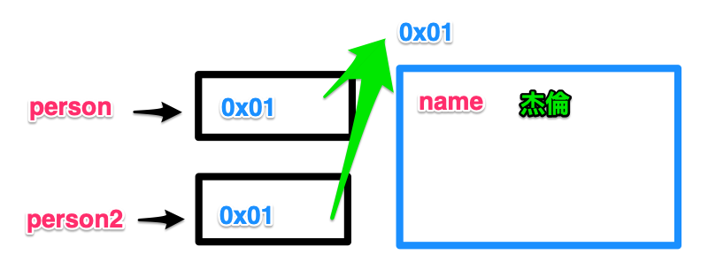
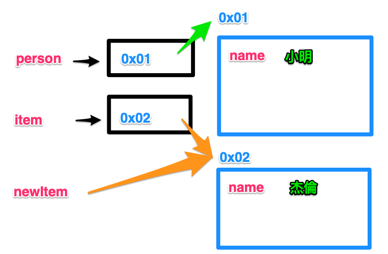

# 物件傳參

紀錄、分析物件傳參的過程

## 值、型別的比較

```js
var fruit = 'Apple';

// example 1
var fruit2 = fruit;
console.log(fruit === fruit2); // true

// example 2
fruit2 = 'Banana';
console.log(fruit === fruit2); // false
```

## 物件的傳遞

JS 中沒有陣列、函式的型別，除了原始型別，其餘都是物件）

範例程式碼：

```js
var person = {
  name: '小明'
}
var person2 = person;
person2.name = '杰倫';

console.log(person.name) // 小明
```

實際情況：



```js
// 陣列
var member = ['爸', '媽'];
var member2 = member;
member2.push('小三');
console.log(member); // ['爸', '媽', '小三'];

// 函式
function fn(name) {
  return `${name} 被抓到了`;
}
var fn2 = fn;
fn2.magicName = '加入奇怪的屬性'; // 因為是物件所以沒有問題
console.log(fn === fn2); // true

// 查看 fn2 屬性
console.dir(fn2);

// 傳遞物件、函式
var 名偵探 = console;
名偵探.柯南 = console.log;
名偵探.柯南('名偵探.柯南');
```

避免低級錯誤

```js
const person = {
  name: '小明'
}
person.name = '杰倫';

console.log(person.name); // 依舊可以操作物件內容，但是 const 可以防止物件被覆寫
```

物件作為參考傳入

```js
function fn(item) {
  item.name = '杰倫';
}
const person = {
  name: '小明'
}

fn(person);
console.log(person); // 杰倫
```

物件參數被重新指向

```js
function fn(item) {
  const newItem = {
    name: '杰倫'
  }

  item = newItem;
}
const person = {
  name: '小明'
}

fn(person);
console.log(person); // 小明，實際情況只有 item 指向新的物件記憶體位置
```

實際情況：



承接上述情況，如何修改 person？

```js
function fn(item) {
  const newItem = {
    name: '杰倫'
  }

  // 利用 Object.keys
  Object.keys(item).forEach(keyName => {
    item[keyName] = newItem[keyName];
  })
}
const person = {
  name: '小明'
}

fn(person);
console.log(person); // 內部 item 以及外部 person 都修改為 '杰倫'
```

移除參考特性

1. 淺複製<br />
  可以透過語法糖 '展開運算子' 達成
2. 深複製
  - 透過 JSON.parse, JSON.stringify 達成

```js
const family = [{name: '爸'}, {name: '媽'}];
family.forEach(item => {
  const newItem = {
    name: '杰倫'
  }

  item = newItem; // 內部的 item 只是被重新指向新的物件記憶體位置，此處新的物件為 newItem
})

console.log(family); // 不會被替換成杰倫
```

說實在的我不相信會有低能兒這樣寫，面試考這個實在是在秀下限，而不是考觀念

```js
var person = {
  name: '小明'
}

person.person = person; // = 其實是在進行記憶體指向的操作、綁定，此處綁定的是一開始物件記憶體位置，因此會形成迴圈。當使用 person.person 呼叫的同時，由於指向原始的 person 記憶體位置，但是原始的 person 其中已經有了新加入的 person 屬性，而這個新加入的 person 屬性，又會去尋找原始被指向 person 如此一來就形成了一個指向迴圈。

console.log(person.person === person.person.person);
```

```js
var a = {
  name: '小明'
}
var b = a; // 目前為止指向相同記憶體位置

a.y = a = {
  name: '杰倫'
}
// a = { name: '杰倫' } 會回傳 { name: '杰倫' } 
// a.y 與 b.y 是相同的，因此目前為止，可以認為 a.y === { name: '杰倫' }
// a.y = { name: '杰倫' }; // a = { name: '杰倫' }; 視為一個表達式
// 最後的記憶體指向會是 b.y === a，而原 a 的記憶體位置，即目前的 b 所有

console.log(a === b); // false
console.log(b.y === a); // true
```
