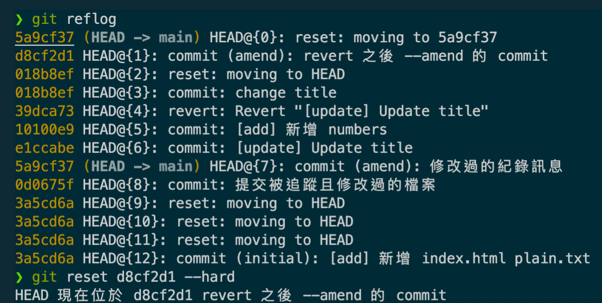
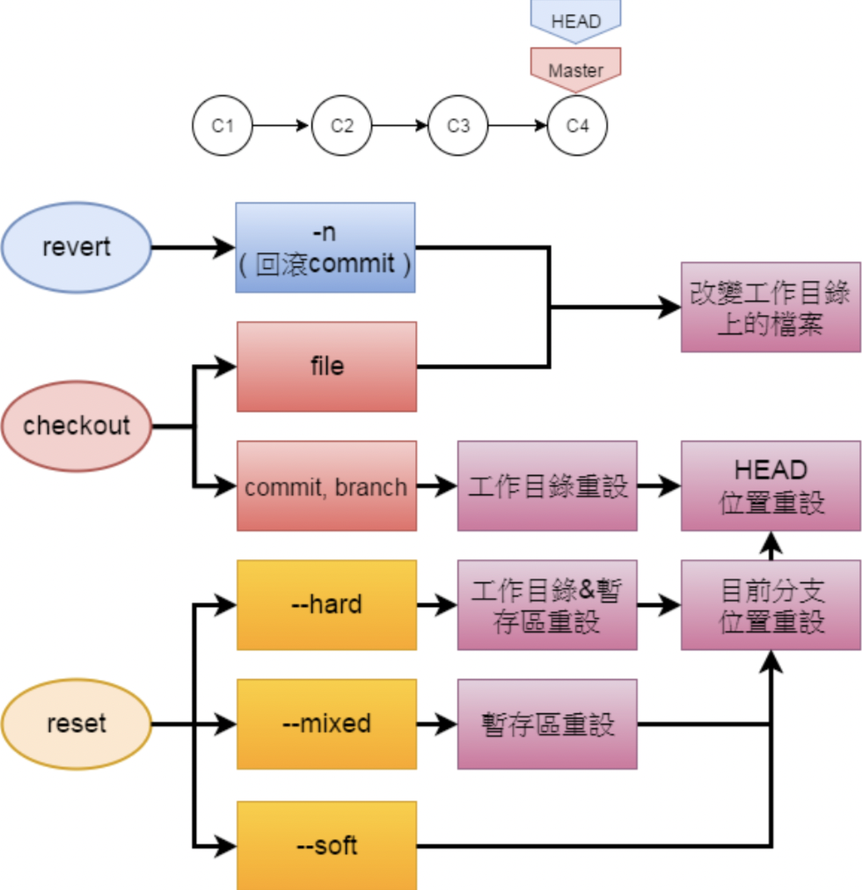

# Git Advanced

紀錄 Git 相對進階一點的知識。

## 選擇性加入索引

此為 `git add` 的進階應用。

```sh
# 選擇部分內容加入索引（暫存區），檔案需要先被提交過
# s 切割更小區塊
# y 加入該區塊到暫存區
# n 略過該區塊
# e 手動編輯
git add -p
```

## 復原檔案

三種復原的方法

- `git checkout`
- `git revert`
- `git reset`

### `git checkout`

常用於復原單一檔案，但此做法在重設工作目錄時效率低下，會轉而使用 `git reset --hard`

```sh
# 方法一
git checkout FileName

# Example
git checkout index.html
```

復原**單一檔案**，但由於還原的檔案取自暫存區，因此當修改過的檔案一但進入到暫存區，就無法還原到被修改之前的狀態。

更進一步的來說，如果被修改的檔案進到暫存區，此時如若又對這份被修改過的檔案且已進入到暫存區，又對其進行修改，接著又對該檔案使用 `git checkout FileName`，則會還原到剛進暫存區的狀態，因為此時心修改的內容尚未被加入到暫存區。

為了不要讓上述的問題混淆，可以透過指定 Commit ID 解決此問題。

```sh
# 方法二
git checkout Commit_ID FileName

# Example
git checkout HEAD index.html
```

透過方法二恢復檔案，恢復的檔案預設會被加入到暫存區，如果有新的修改，必須要重新 `git add` 到暫存區中。

### `git revert`

復原 commit 做過的事情，並且自動提交 commit。

使用情境，在修復 bug 時以為已修復並提交，結果發現 bug 依然存在，即可透過此指令進行復原。

```sh
# 取消自動提交
git revert Commit_ID -n

# 搭配 git commit --amend 使用，修復最後一筆
git revert Commit_ID -n
git commit --amend -m "Some Completed Text"

# 連續的 rollback（需注意 commit 連貫性，即順序
git revert Commit_ID_1 Commit_ID_2 Commit_ID_3
```

### `git reset`

使用 `git checkout main` 也可以達成類似的效果，但是被修改的異動，並不會還原，而是連帶附加上去。

```sh
# 清除、重設當前的暫存區以及工作目錄
git reset --hard

# 清除、重設當前的暫存區、工作目錄，並移動分支、HEAD 到指定 commit
git reset Commit_ID --hard

# 保持工作目錄不變, 清除暫存區
git reset --mixed

# reset 至某個 commit, 但保持工作目錄不變, 清除暫存區，主要用於 打散或合併commit
git reset Commit_ID --mixed

# 分支、HEAD、工作目錄、暫存區皆不變（基本沒有用途
git reset --soft

# 重設分支、HEAD，但工作目錄、暫存區皆不變
git reset Commit_ID --soft
```

使用 `git reset --hard` 可能會導致錯誤的重置，因此使用必須特別小心，不過假如修改的內容曾經提交，那麼即使被 reset 依舊可以透過 `git reflog` 之類的指令進行修復。（前提是 git 還未執行 garbage collection, 應該是 30 days

### 查閱 `HEAD` 的歷史移動紀錄

透過 `git reflog` 找到要復原的節點，搭配 `git reset Commit_ID --hard` 即可修復。



### revert vs. checkout vs. reset



## 切換視點

透過 `git checkout` 移動 `HEAD`，但由於 `git log` 預設只會顯示 `HEAD` 以前的提交紀錄，因此如果需要查看完整的提交紀錄，可以使用 `git log --all`

```sh
git checkout Commit_ID
```

如果要移動 `HEAD` 重新指回 `main` 分支，只需要使用以下語法

```sh
git checkout main
```

此部分也是可以透過 Commit_ID 指向與 main 一樣視點，但差異在於直接將 `HEAD` 指向 Commit_ID，在下次進行提交時，分支 `main` 就不會同步更新，並且 Commit_ID 並沒有比 `main` 分支名稱來得更容易記憶，因此使用分支名稱，會是比較好的做法。

## 標籤

建立重大里程碑。

```sh
# 建立標籤
git tag -a "v1.0" -m "message"

# 查閱標籤紀錄
git cat-file -p v1.0
```
