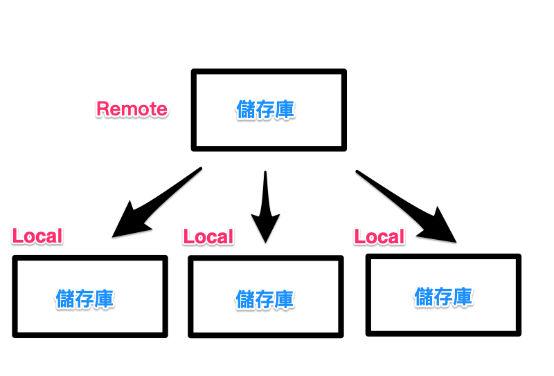
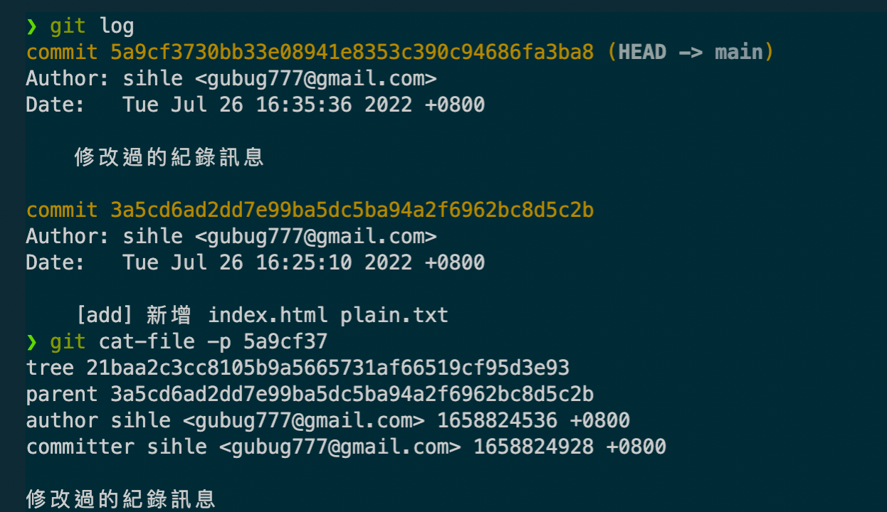
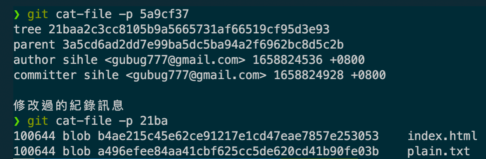

# Git Basic

這裡記錄一些 git 的基礎知識。

## 誰需要使用版本控制

但凡需要接觸程式碼的位置。

- 網頁設計師（Dreamweaver，圖轉碼
- 前端工程師
- 後端工程師
- 韌體工程師

...諸如以上此類

然而**視覺設計師**除外，因圖案類型的檔案為二進制的編碼，對於 git 此類的版本控制軟體難以進行檔案比對。

## 遇到的瓶頸

- 檔案錯置（檔案被覆蓋
- 程式碼改壞
- 實驗性功能
- 當機
- 復原舊功能

不過透過版本控制，上述的問題都可以得到解決。

版本控制可以完整的紀錄檔案的變化過程，例：查詢歷史紀錄、復原變更、比對差異、分支合併、協同作業等等...

## 類似的版控軟體

CVS, **SVN**, **Git**, TFS

## Git 是什麼？

作者為 Linux Torvalds，Git 最初只花了 10 天建立其雛形，其目的是要用來管理 Linux 的核心程式碼。

Git 提供分散式的版控架構，也就是支援本地端版控儲存庫，這意味著可以不用連網，就能進行版控的相關工作，也因為這種分散式的架構，讓集中管理程式碼的風險大大降低。

::: tip
可以用 Email 更新？
Ans：透過 Email 傳送版控檔案
:::



## 學圖形介面還是指令介面？

都學，指令介面可以完整了解整個版控的流程，圖形介面可以幫助在需要輸入過多指令時簡化流程。

## 安裝 Git

- Windows - 下載、下一步、下一步、下一步
- Mac M1 - 這裡採用 [Homebrew](https://brew.sh/index_zh-tw) 的方式安裝

```sh
# 安裝 Homebrew
/bin/bash -c "$(curl -fsSL https://raw.githubusercontent.com/Homebrew/install/HEAD/install.sh)"

# 安裝 Git
brew install git
```

::: tip
如果遇到找不到 brew 指令的時候，，可以嘗試重啟終端機
:::

## 初始化

建立基本資訊，以及建立**本地端**儲存庫。

```sh
# 使用者名稱
git config user.name "UserName"
git config --global user.name "UserName"
# 使用者信箱
git config user.email "User@Mail.com"
git config --global user.email "User@Mail.com"

# 1. 建立工作目錄，Working dir
mkdir [DirName]
# 2. 切換至該工作目錄
cd [DirName]
# 3. 初始化 git（建立 .git
git init
```

其它指令

```sh
# 簡化目錄建立以及初始化
git init [DirName]

# 若想要預設主要分支為 main
git config --global init.defaultBranch main

# 查看設定
git config --list # 全域
git config --list --local # 當前目錄設定
git config --list --global # 全域
git config --list --system # 系統
```

## Stagin Area（暫存區

在檔案進入到 Repo 之前的一個暫存區。

## 查閱檔案索引狀態

透過 `git status` 可以查閱檔案的索引狀態，也就是有沒有被追蹤，或者是有無進入暫存區中等待提交。

- Untracked Files - 尚未被加入到索引中（暫存區

## 檔案加入索引

加入暫存區，透過 `git add .` 快速加入所有檔案到暫存區中。（無論追蹤與否

```sh
# 快速加入索引
git add .

# 加入 單一檔案、多個檔案，與萬用字元 * 併用
git add *.html *.js index.css

# 加入 已被提交（追蹤）且修改過的檔案 到索引
git add -u
```

## 移除索引

從暫存區移除（unstage

```sh
# 從索引移除
git reset index.html

# 快速將所有檔案從索引移除
git reset

# git 的提示建議，雖然不好用
git rm --cached
```

## 提交檔案

正式將檔案提交到本地端的儲存庫。

```sh
# 提交並撰寫紀錄訊息
git -m "Some Text"

# 提交已被追蹤並且修改過的檔案（新增且進入索引的檔案也會
git -am "Some Text"

# 修改最後一次提交內容的紀錄訊息
git commit --amend -m "Some Update Text"
```

## 查閱提交紀錄

名詞說明

- HEAD - 與工作目錄比對的基準
- master or main - 預設的分支名稱（通常指向當前 commit

當每次提交時，`HEAD` 以及 `main` 都會自動指向最新的 commit

```sh
# 查閱提交紀錄
git log

# 顯示所有提交紀錄（當 HEAD 與分支不同步時
git log --all

# 簡易線圖
git log --all --graph

# 顯示最後一個提交紀錄，並顯示修改內容
git show

# 指定 Commit ID 與上一版的差異
git show [Commit_ID]

# 指定 Commit ID 的指定檔案 與上一版的差異，但若無差異，會顯示空白
git show Commit_ID FileName

# 指定 Commit ID 的指定檔案的完整檔案內容（不論與前版有無差異
git show Commit_ID:FileName
```

### 查閱特定 hash id 內容

查閱特定 hash id 內容（hash id 最少 4 碼，重複則多補

```sh
git cat-file -p HASH_ID
```



`tree` 提交檔案的結構內容
`parent` 前一個 commit

查看 tree 結構



再往內查看 blob 實際提交檔案內容（內容太多，不附圖了

- 040000 表目錄

::: tip
git 透過雜湊內容得到 hash code，因此不同目錄的檔案，如果內容相同，是可能會得到相同的 hash code.
:::

## 忽略的檔案清單

建立 `.gitignore` 並將欲略過的檔名或目錄加入（可使用萬用字元

線上快速建立 `.gitignore` 工具 [gitignore.io](https://www.toptal.com/developers/gitignore)

## 檔案差異的比較

使用 `git help diff` 查看 `diff` 的描述

Show changes between the `working tree` and the index or a tree, changes between the index and a tree, changes between two trees, changes resulting from a merge, changes between two blob objects, or changes between two files on disk.

```sh
# 比較 Working Tree 與暫存檔的差異
git diff

# 有些混亂
git diff --cached
git diff HEAD
```
